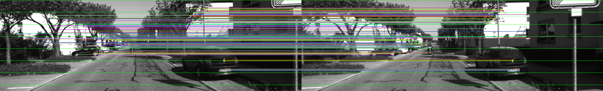

# StereoVision Edge Toolkit

A high-performance, low-latency stereo vision toolkit optimized for edge devices, featuring robust feature matching, zero-allocation rectification, and real-time depth estimation.

## Overview

**StereoVision Edge Toolkit** is designed to bring accurate 3D perception to resource-constrained environments. By leveraging hardware acceleration and zero-allocation pipelines, it enables real-time stereo processing on embedded platforms (e.g., Raspberry Pi, NVIDIA Jetson, ARM Cortex) without sacrificing accuracy. 

This project is currently in active development. The core rectification pipeline and the ORB-based feature matching engine have been successfully implemented and tested. Dense stereo matching and advanced occlusion handling are currently in the works.

## Key Features

- **Zero-Allocation Rectification**: Precomputes undistortion and rectification maps to ensure the runtime pipeline introduces no dynamic memory allocations.
- **Edge-Optimized Feature Matching**: Utilizes the ORB algorithm with cross-check matching and strict geometric epipolar constraints to rapidly filter outliers with minimal CPU overhead.
- **Edge-Optimized Pipeline**: Tailored for low-power CPUs and embedded GPUs, utilizing OpenCV's optimized primitives.
- **Occlusion Handling**: *(In Progress)* Advanced algorithms to detect and handle occluded regions in stereo pairs, reducing noise and artifacts in depth maps.
- **Accurate 3D Reconstruction**: Provides direct access to the reprojection matrix (`Q`) and valid Regions of Interest (ROIs) for seamless integration with downstream 3D processing.

### Feature Matching Verification
Below is an example of the feature matching results on a rectified stereo pair. The green horizontal lines demonstrate the strict epipolar constraints applied to filter out invalid matches.



## Project Architecture

The toolkit is organized into modular components under the `StereoVision::core` namespace:

- **`RectificationEngine`**: Handles camera calibration, precomputes rectification maps, and applies them to raw stereo pairs.
- **`FeatureMatchingEngine`**: Detects, describes, and matches features using ORB, applying hardware-friendly geometric constraints (epipolar and disparity limits).
- **`StereoMatcher`**: *(In Progress)* Performs dense pixel matching to generate disparity maps.
- **`OcclusionHandler`** *(Coming Soon)*: Filters invalid disparities and fills occluded regions.
- **`DepthEstimator`** *(Coming Soon)*: Converts disparity maps into metric 3D point clouds.

## Prerequisites

- C++17 compatible compiler
- [OpenCV](https://opencv.org/) (version 4.5 or higher recommended)
- [Eigen3](http://eigen.tuxfamily.org/)
- CMake (version 3.14+)

## Building

```bash
# Clone the repository
git clone https://github.com/abdulrahman-1212/StereoVisionToolkit.git
cd StereoVisionToolkit

# Create a build directory
mkdir build && cd build

# Configure and build
cmake ..
make -j$(nproc)
